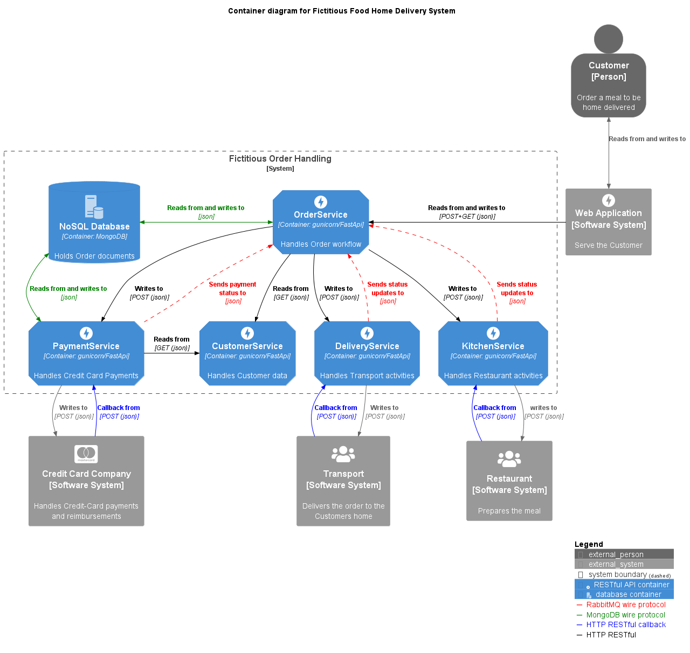

# fastapi_messaging

Elaborate Microservice async example with FastAPI, RabbitMQ, MongoDB and Redis.

## Author: Anders Wiklund

This repository is the basis for a series of **Medium** articles.

### Here's a brief outline of the article parts

#### [Part 1: Introduction and installation of required components](https://medium.com/@wilde.consult/elaborate-microservice-async-example-with-fastapi-rabbitmq-mongodb-and-redis-part1-4e5516cc8d4d)
This part talks about the problem space and a solution to handle asynchronous events between Microservices. It also covers the installation of required components.

#### [Part 2: OrderService Architecture and Design patterns](https://medium.com/@wilde.consult/elaborate-microservice-async-example-with-fastapi-rabbitmq-mongodb-and-redis-part2-19bc0790d5d4)
This part talks about the OrderService architecture and design patterns that are used and the resulting directory structure of the implementation.

#### [Part 3: OrderService usage of RabbitMQ](https://medium.com/@wilde.consult/elaborate-microservice-async-example-with-fastapi-rabbitmq-mongodb-and-redis-part3-d73393739277)
This part talks abour RabbitMQ integration with FastAPI.

#### [Part 4: PaymentService Architecture and Design patterns](https://medium.com/@wilde.consult/elaborate-microservice-async-example-with-fastapi-rabbitmq-mongodb-and-redis-part4-e50b22ce0a04)
This part talks about the PaymentService architecture and design patterns that are used and the resulting directory structure of the implementation.

#### [Part 5: FastAPI enhancements](https://medium.com/@wilde.consult/elaborate-microservice-async-example-with-fastapi-rabbitmq-mongodb-and-redis-part5-300768a028e6)
This part adds initial configuration handling using the Pydantic **BaseSettings** class. Project parameters in an .env file. External component connection URLs 
are using Pydantic secrets files. We also go through unified logging and OpenAPI documentation.

#### [Part 6: Putting it all together](https://medium.com/@wilde.consult/elaborate-microservice-async-example-with-fastapi-rabbitmq-mongodb-and-redis-part6-29783c2278c4)
This part ties it all together. How to run it, simulators and all.
